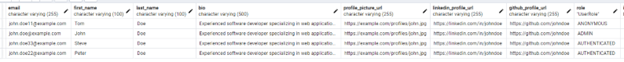
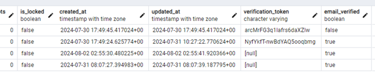
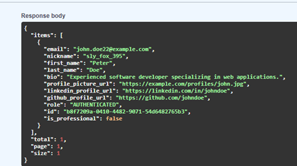
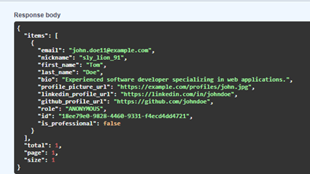
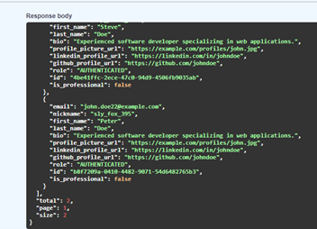
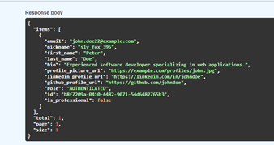
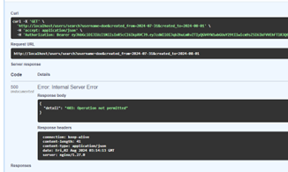

# Introduction
The user management system is a fundamental component of modern web applications, responsible for handling user registration, authentication, profile management, and various administrative functions. This system ensures that user data is managed securely and efficiently while providing a seamless experience for various user roles. This report documents the development and implementation of the User Search and Filtering feature, identifying QA issues in the existing code and providing test coverage  using FastAPI, SQLAlchemy, and Pytest. 
My experience working on the user management API project has been a rewarding that provided valuable insights into web development and API design. The project involved developing comprehensive functionalities such as user registration, authentication, profile management, and administrative controls. Implementing features like user search and filtering required a deep understanding of FastAPI, asynchronous programming, and SQLAlchemy for database interactions. Additionally, writing thorough tests with pytest and mastering mocking techniques ensured the robustness and reliability of the system. This hands-on experience has enhanced my technical skills, problem-solving abilities, and reinforced the importance of best practices in software development.

### Contributor: Deepthi Sachidanand

### Feature Implementation
The user search and filter feature is designed to enhance the user management system by allowing administrators to efficiently locate and manage users based on various criteria. This functionality includes searching users by username, email, and role, as well as filtering by account status and registration date range. The implementation involved creating API endpoints using FastAPI, developing dynamic query capabilities with SQLAlchemy, and ensuring robust error handling and logging. This feature significantly improves the administrative capabilities of the system, providing a user-friendly and efficient means to handle large datasets and perform targeted user management tasks.
- Code:
1. [User Search and Filter API](https://github.com/deepthisanand2024/FinalProject_UserManagement/blob/main/app/routers/user_routes.py)
2. [UserSearchFilter](https://github.com/deepthisanand2024/FinalProject_UserManagement/blob/main/app/schemas/user_schemas.py)
3. [search_and_filter_users](https://github.com/deepthisanand2024/FinalProject_UserManagement/blob/main/app/services/user_service.py)

#### Test Scenarios - Screenshots
##### User Registration

##### User Search Option 

##### Search by first name Peter: Response URL

##### Search by Email john.doe@example.com

##### Search by role Authenticated

##### Filter feature

##### Non-admin users unable to perform Search functionality

- Test Coverage: Pytest has been used as our testing framework to validate the functionality of User Search and Filter feature. 10 new pytests implemented. Test files are placed in the  [test_services](https://github.com/deepthisanand2024/FinalProject_UserManagement/blob/main/tests/test_services/test_user_service.py) directory.

- QA issues: Below QA issues reported. The Steps to reproduce the issue and the resolution has been provided in the issue description.
1.	[Issue 1](https://github.com/deepthisanand2024/FinalProject_UserManagement/issues/1)
2.	[Issue 2](https://github.com/deepthisanand2024/FinalProject_UserManagement/issues/2)
3.	[Issue 3](https://github.com/deepthisanand2024/FinalProject_UserManagement/issues/4)
4.	[Issue 4](https://github.com/deepthisanand2024/FinalProject_UserManagement/issues/6)
5.	[Issue 5](https://github.com/deepthisanand2024/FinalProject_UserManagement/issues/10)

### [Docker Repository](https://hub.docker.com/repository/docker/deepthisanand/devops_demo/general)

### Learnings
Throughout this course, I have gained extensive knowledge and practical skills across various modern technologies and tools integral to contemporary software development. Each module offered a unique learning opportunity, contributing significantly to my understanding and proficiency in building robust web applications. Here is a summary of my key learnings from each segment of the syllabus:
GitHub
•	Version Control: Mastered the basics of Git, including creating repositories, branching, merging, and resolving conflicts.
•	Collaboration: Learned how to effectively use GitHub for collaborative development, including pull requests, code reviews, and managing issues.
•	Continuous Integration: Implemented CI/CD pipelines using GitHub Actions to automate testing and deployment processes.
Docker
•	Containerization: Gained a solid understanding of containerization concepts and how Docker streamlines application deployment.
•	Docker Compose: Learned to use Docker Compose for defining and running multi-container Docker applications, facilitating a consistent development environment.
•	Image Management: Acquired skills in creating, managing, and optimizing Docker images for efficient application performance.
Pytest
•	Testing Fundamentals: Developed a strong foundation in writing unit tests, integration tests, and end-to-end tests using pytest.
•	Test Automation: Implemented automated testing pipelines to ensure continuous quality assurance in the development lifecycle.
FastAPI
•	API Development: Gained proficiency in building fast, scalable, and efficient APIs using FastAPI, leveraging its asynchronous capabilities.
•	Dependency Injection: Mastered FastAPI’s dependency injection system to manage application components and services effectively.
•	Error Handling and Logging: Implemented robust error handling and logging mechanisms to ensure the reliability and maintainability of APIs.
SQLAlchemy
•	ORM Concepts: Developed a thorough understanding of Object-Relational Mapping (ORM) and how SQLAlchemy bridges the gap between Python objects and relational databases.

### Conclusion
The comprehensive coverage of tools and technologies in this course has equipped me with the essential skills required for modern software development. Each module built upon the previous one, providing a holistic understanding of how to develop, test, and deploy robust web applications. The practical experience gained through hands-on projects, particularly the user management API, has been invaluable in reinforcing theoretical knowledge and preparing me for real-world development challenges.
